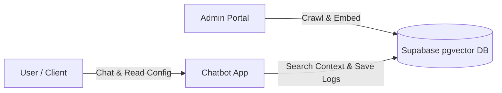

# 🤖 Decoupled RAG Chatbot Suite (100% Free)

A decoupled, multi-tenant RAG chatbot system. It contains two standalone applications reading/writing to a shared free-tier **Supabase PostgreSQL database** with `pgvector` enabled:

1. **⚙️ Admin Portal (`admin_app.py`)**: Crawl websites, manage different bots, and view analytics/conversations.
2. **💬 Chatbot Interface (`chatbot_app.py`)**: Customer-facing chatbot that retrieves configuration and context based on a URL parameter (e.g. `?botId=acme-corp`) and logs transcripts.

---

## 🏗️ Architecture & Flow



---

## 🚀 Step 1: Set Up Your Free Database (Supabase)

1. Sign up for a free account at [Supabase](https://supabase.com/).
2. Create a new project (e.g. "RAG Chatbots"). Keep note of your **Project URL** and **API Key (anon or service_role)**.
3. In your Supabase Dashboard, click on **SQL Editor** (on the left menu).
4. Click **New Query**, copy the entire contents of [`database_setup.sql`](file:///home/user/Documents/Projects/chatbot/database_setup.sql), paste it in, and click **Run**.
   * *This will enable vector search, create the tables, and register the search function.*

---

## 🚀 Step 2: Deploy Both Standalone Apps (Streamlit Cloud)

Streamlit Community Cloud allows you to deploy multiple apps from the same GitHub repository for free!

### 1. Push Code to GitHub
```bash
git init
git add .
git commit -m "Decoupled multi-tenant RAG architecture"
# Create a repository on GitHub and run:
git remote add origin https://github.com/YOUR_USERNAME/YOUR_REPO_NAME.git
git branch -M main
git push -u origin main
```

### 2. Deploy the Admin Portal
1. Go to [share.streamlit.io](https://share.streamlit.io/) and click **New app**.
2. Select your repository, set main file path to `admin_app.py`.
3. In **Advanced Settings -> Secrets**, add:
   ```toml
   SUPABASE_URL = "https://your-project.supabase.co"
   SUPABASE_KEY = "your-supabase-key"
   GEMINI_API_KEY = "your-google-ai-studio-key"
   ```
4. Click **Deploy**. (Keep this URL private so only you/admins can access it).

### 3. Deploy the Chatbot Client
1. Click **New app** again.
2. Select the same repository, set main file path to `chatbot_app.py`.
3. In **Advanced Settings -> Secrets**, paste the **same** secrets configuration.
4. Click **Deploy**. (This is your public client URL, e.g. `https://client-bot.streamlit.app`).

---

## 🛠️ How to Use It

1. **Create a Bot**: Open the Admin Portal. In the **Bot Management** tab, create a bot (e.g., ID: `my-client`, Name: `Client Support`).
2. **Ingest Data**: Enter their website URL (e.g., `https://example.com`), and click **Crawl & Ingest**. The app will crawl pages, convert them into vector embeddings via Gemini, and upload them to Supabase.
3. **Open the Chatbot**: 
   * Navigate to `https://client-bot.streamlit.app/?botId=my-client`.
   * The app will load the `my-client` styling and documents and start answering user queries using those pages.
4. **Monitor Conversations**: Any message sent by a user will automatically log into Supabase. Go to the **Analytics & Chat Logs** tab in your Admin Portal to inspect conversation metrics and transcripts live!

---

## 💻 Local Testing (Optional)

1. Install requirements:
   ```bash
   pip install -r requirements.txt
   ```
2. Run Admin Portal:
   ```bash
   streamlit run admin_app.py --server.port 8501
   ```
3. Run Chatbot Client:
   ```bash
   streamlit run chatbot_app.py --server.port 8502
   ```
# ragchat
